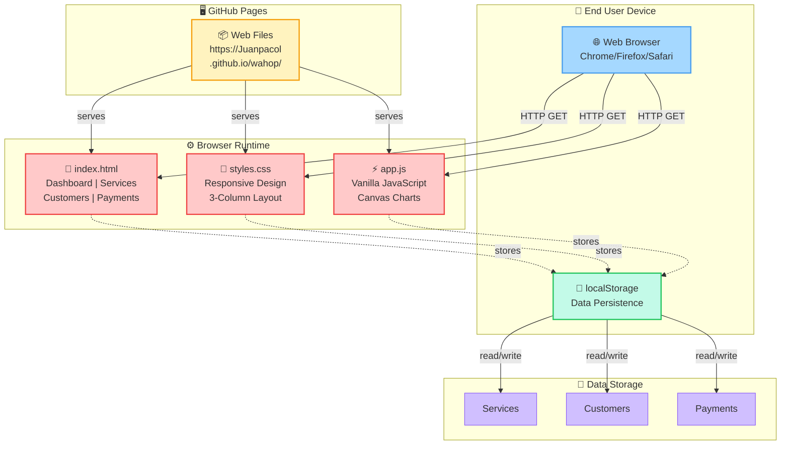

# Diagrama de Despliegue UML - WASHOPS

## 📋 Componentes del Diagrama

### Nodos (Nodes)
- **End User Device** - Máquina física del usuario
- **Browser Runtime** - Ambiente de ejecución del navegador
- **GitHub Pages Server** - Servidor de hosting

### Artefactos (Artifacts)
- **index.html** - Estructura de 5 páginas
- **styles.css** - Estilos y diseño responsive
- **app.js** - Lógica de aplicación (Vanilla JS)
- **Web Files** - Archivos en el servidor

### Comunicaciones (Relationships)
- **→** Flujo principal (HTTP GET)
- **-.->** Flujos secundarios (store/read)

### Datos (Data)
- **Services** - Servicios creados
- **Customers** - Clientes generados
- **Payments** - Pagos registrados

## 🔄 Flujo del Sistema

1. **User abre navegador** → Accede a https://Juanpacol.github.io/wahop/
2. **GitHub Pages** → Sirve index.html, styles.css, app.js
3. **Browser renderiza** → Muestra la interfaz WASHOPS
4. **Usuario interactúa** → Crea servicios, ve reportes, etc.
5. **JavaScript** → Almacena datos en localStorage
6. **localStorage** → Persiste datos entre sesiones

## 🛠️ Tecnologías por Componente

| Componente | Tecnología | Propósito |
|-----------|-----------|----------|
| Browser | Chrome/Firefox/Safari | Renderizar la aplicación |
| HTML | HTML5 | Estructura de las 5 páginas |
| CSS | CSS3 | Diseño responsive y temas |
| JavaScript | Vanilla JS | Lógica y interactividad |
| Storage | localStorage API | Persistencia de datos |
| Server | GitHub Pages | Hosting gratuito con HTTPS |
| Protocol | HTTPS | Comunicación segura |

## 📊 Capacidades del Sistema

✅ **Estático** - No requiere servidor backend  
✅ **Offline** - Funciona con datos en localStorage  
✅ **Rápido** - Sin latencia de red para interacciones  
✅ **Escalable** - Se puede migrar a backend en el futuro  
✅ **Seguro** - HTTPS automático en GitHub Pages  
✅ **Gratuito** - Hosting sin costo  

---

**Diagrama Generado:** 2026-05-08  
**Herramienta:** Mermaid  
**Formato:** UML Deployment Diagram
